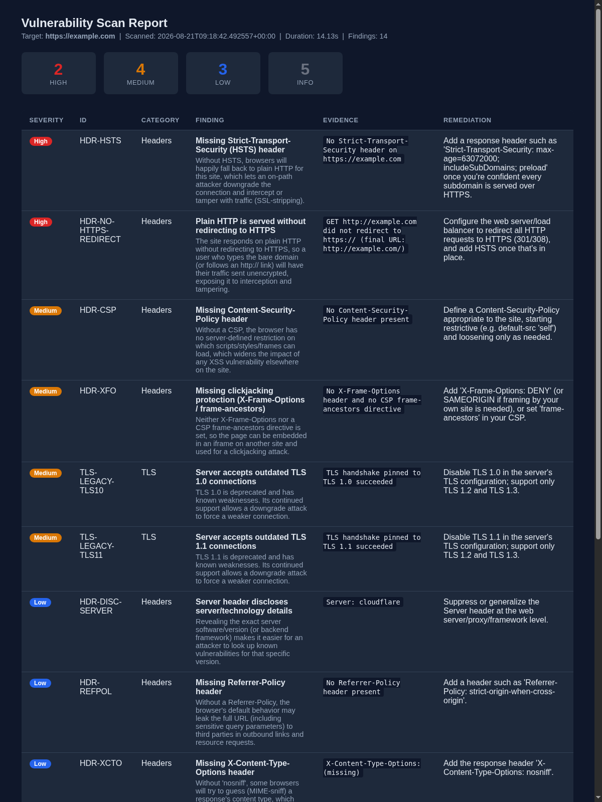

# vulnscan

A defensive vulnerability scanner for web servers, built in Python. It checks a target for
missing security headers, TLS/SSL certificate and protocol issues, unexpectedly open ports,
and common misconfigurations — then produces a severity-rated report explaining what's wrong
and how to fix it.

Built as a portfolio project to demonstrate practical, defensive application-security tooling:
detection and reporting only, no exploit code.

> ## ⚠️ Authorized use only
> This tool makes active network connections to the target you give it. **Only scan hosts you
> own or have explicit written permission to test.** Scanning systems without authorization may
> be illegal where you live. `vulnscan` requires you to confirm authorization before every scan
> (or pass `--yes-i-am-authorized` for scripted use).
>
> Don't have a target of your own handy? These are public, permission-granted test targets built
> for exactly this purpose:
> - [`scanme.nmap.org`](https://nmap.org/book/legal-issues.html) — the Nmap project's official scan-me target (port scanning)
> - [`badssl.com`](https://badssl.com) and its subdomains (`expired.badssl.com`, `self-signed.badssl.com`, `tls-v1-0.badssl.com`, ...) — deliberately broken TLS configurations
> - `example.com` — IANA's reserved documentation domain (headers/misconfig checks)

## Screenshot



*(Full sample reports: [HTML](sample_reports/example-scan-report.html), [JSON](sample_reports/example-scan-report.json) — generated against `example.com`.)*

## Features

- **Security headers** — HSTS, Content-Security-Policy, X-Frame-Options / `frame-ancestors`,
  X-Content-Type-Options, Referrer-Policy, Permissions-Policy, `Server`/`X-Powered-By`
  disclosure, cookie flags (`Secure`/`HttpOnly`/`SameSite`), and plain-HTTP-without-redirect.
- **TLS/SSL** — certificate expiry (expired / expiring soon), untrusted or hostname-mismatched
  certificates, legacy protocol support (TLS 1.0/1.1), weak negotiated cipher suites.
- **Open ports** — a bounded, concurrent TCP-connect scan (no raw sockets, no root needed) over
  a curated list of common ports, flagging unexpectedly exposed databases/caches/admin services.
- **Misconfigurations** — exposed sensitive files (`.git/HEAD`, `.env`, backups, ...) with a
  soft-404 baseline check to avoid false positives, directory listing, permissive/reflected CORS.
- **Reporting** — colorized console output, machine-readable JSON (for CI/tooling), and a
  self-contained HTML report (dark/light aware, no external assets — safe to screenshot or
  share as a single file).
- Every finding includes a severity (High/Medium/Low/Info), the concrete evidence observed,
  and specific remediation guidance.

## Architecture

```
vulnscan/
├── cli.py            # argparse entry point + authorization gate
├── scanner.py         # runs registered checks, aggregates Finding objects
├── models.py           # Finding / ScanResult data model
├── utils.py             # target parsing, shared safe-request helper
├── checks/
│   ├── headers.py     # HTTP security header checks
│   ├── tls.py           # certificate + protocol/cipher checks
│   ├── ports.py          # bounded TCP-connect port scan
│   └── misconfig.py       # exposed files, directory listing, CORS
└── report.py            # console (rich) / JSON / HTML renderers
```

Each check module registers itself with the scanner on import (`register_check(...)`), takes a
parsed `Target`, and returns a list of `Finding`s. Adding a new check means adding one file to
`checks/` — the CLI, scanner, and all three report formats pick it up automatically.

## Installation

Requires Python 3.10+.

```bash
git clone <this-repo>
cd vuln-scanner
python3 -m venv .venv && source .venv/bin/activate   # optional but recommended
pip install -r requirements.txt
```

## Usage

```bash
# Interactive — asks you to confirm you're authorized to scan the target
python -m vulnscan.cli example.com

# Console report (default format)
python -m vulnscan.cli https://example.com --format console

# JSON, written to a file (for CI pipelines / other tooling)
python -m vulnscan.cli example.com --format json -o report.json --yes-i-am-authorized

# Self-contained HTML report
python -m vulnscan.cli example.com --format html -o report.html --yes-i-am-authorized

# Custom port list/ranges
python -m vulnscan.cli example.com --ports 22,80,443,8000-8100 --yes-i-am-authorized
```

If installed via `pip install -e .` (see `pyproject.toml`), a `vulnscan` command is also
available directly instead of `python -m vulnscan.cli`.

The process exits with code `1` if any **High**-severity finding was reported (useful for CI
gating), `0` otherwise.

### Sample output

```
╭─────────────────────── vulnscan report ───────────────────────╮
│ Target: https://example.com   Duration: 15.23s   Findings: 14 │
╰───────────────────────────────────────────────────────────────╯
 High: 2    Medium: 4    Low: 3    Info: 5

┏━━━━━━━━━━┳━━━━━━━━━━━━━━━━━━━━━━━┳━━━━━━━━━━┳━━━━━━━━━━━━━━━━━━━━━━━━━━━━━━━━━━━━━━━━┓
┃ Sev      ┃ ID                    ┃ Category ┃ Finding                                ┃
┡━━━━━━━━━━╇━━━━━━━━━━━━━━━━━━━━━━━╇━━━━━━━━━━╇━━━━━━━━━━━━━━━━━━━━━━━━━━━━━━━━━━━━━━━━┩
│ High     │ HDR-HSTS              │ Headers  │ Missing Strict-Transport-Security (HSTS) header │
│ High     │ HDR-NO-HTTPS-REDIRECT │ Headers  │ Plain HTTP is served without redirecting to HTTPS │
│ Medium   │ HDR-CSP               │ Headers  │ Missing Content-Security-Policy header │
│ Medium   │ TLS-LEGACY-TLS10      │ TLS      │ Server accepts outdated TLS 1.0 connections │
│ Low      │ HDR-REFPOL            │ Headers  │ Missing Referrer-Policy header │
│ Info     │ PORT-443-OPEN         │ Ports    │ Port 443 (HTTPS) is open │
└──────────┴───────────────────────┴──────────┴─────────────────────────────────────────┘

╭─ High — HDR-HSTS — Missing Strict-Transport-Security (HSTS) header ─────────────╮
│ Without HSTS, browsers will happily fall back to plain HTTP for this site,      │
│ which lets an on-path attacker downgrade the connection and intercept or        │
│ tamper with traffic (SSL-stripping).                                           │
│                                                                                 │
│ Evidence: No Strict-Transport-Security header on https://example.com            │
│ Fix: Add a response header such as 'Strict-Transport-Security: max-age=...'.    │
╰──────────────────────────────────────────────────────────────────────────────────╯
```

(Full run against `example.com`, real output — reflects that domain's actual header/TLS
configuration at scan time.)

## Testing

```bash
pip install pytest   # or: pip install -r requirements.txt pytest
pytest -q
```

The test suite mocks all network I/O (`unittest.mock`) — no live scanning happens in CI, and it
runs in well under a second. Each check module's logic was additionally validated by hand
against real/public targets during development: `badssl.com`'s `expired.`, `self-signed.`, and
`tls-v1-0.` subdomains for the TLS checks, `scanme.nmap.org` for the port scanner, and a
deliberately-misconfigured local test server for the header/misconfiguration checks.

## Design decisions

- **stdlib-first**: only three dependencies (`requests`, `rich`, `cryptography`) — no template
  engine, no scanning framework. The HTML report is built with plain Python string formatting;
  TLS certificates are parsed with `cryptography` (needed because Python's `ssl` module only
  populates certificate fields when the cert validates, which would defeat checking *why* an
  invalid cert is invalid).
- **TCP-connect port scanning only**: no raw sockets/SYN scanning, so no root privileges and no
  `nmap`/`scapy` dependency — keeps the tool simple to run and unambiguous about intent.
- **Soft-404 baseline**: before checking for exposed sensitive files, the misconfiguration check
  first requests a random nonexistent path and compares against it, so sites that return
  `200 OK` for every URL (SPA catch-alls, custom error pages) don't produce false positives.
- **Authorization gate is in the code, not just the docs**: the CLI won't scan anything without
  either an interactive "yes" or an explicit `--yes-i-am-authorized` flag.

## Roadmap

- [ ] Streamlit web dashboard as a thin UI layer over the existing `scanner`/`report` modules
      (no changes to the scanning engine itself — same `Finding`/`ScanResult` model).
- [ ] Parallelize the misconfiguration path checks (currently sequential).
- [ ] Optional authenticated-scan mode (session cookie / auth header passthrough).

## License

MIT — see [LICENSE](LICENSE).
